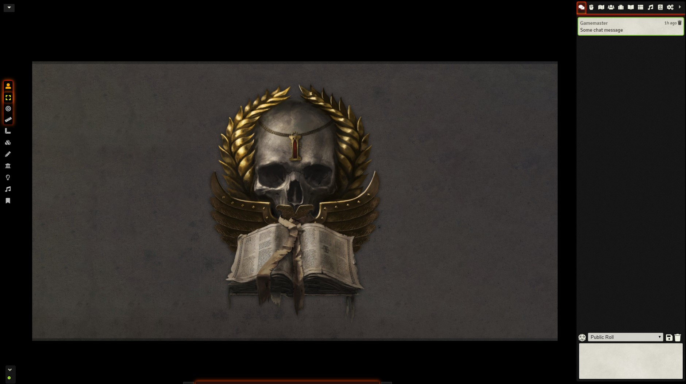

## Minimal UI for FoundryVTT

Reduces the size of Foundry interface and allows hiding or collapsing specific parts of it.

This includes hiding Foundry's Logo, Players List, Scene Navigation and Macro Bar.

Various settings allow for tweaking to personal tastes although the premise is simplicity.

* Hidden Foundry Logo
* Scenes, Player list and left side controls customized for minimalism 
* Macro Bar may be hidden, collapsed, auto-hidden (default) or shown
* Macro Bar may be repositioned
* Allows hiding Players List (Default: Visible)
* Allows Hiding or having the scene navigation collapsed (Default: Collapsed)
* Shrinked icon size and position of the left-side controls as well as vertical expansion

### ToDo:
* More user-based settings
* Customized macro hotbar size
* Any suggestions welcome

