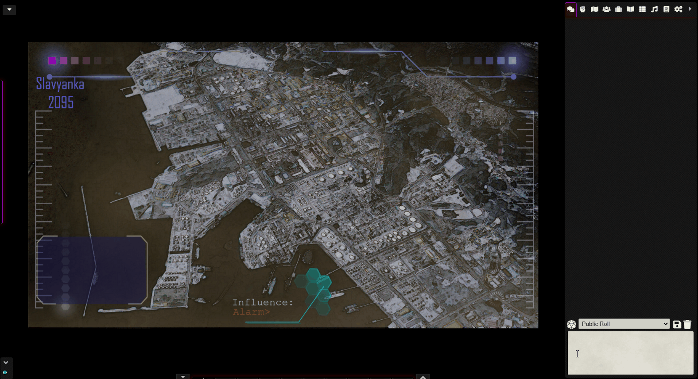

## Minimal UI for FoundryVTT

Configurable UI module, allows the user to hide, collapse or auto-hide components separately.

This includes hiding Foundry's Logo, Players List, Scene Navigation and Macro Bar.

* Hidden Foundry Logo
* Scenes, Player list and left side controls customized for minimalism by default 
* Macro Bar may be hidden, collapsed, auto-hidden (default) or shown
* Macro Bar may be repositioned along the X-Axis
* Players list may be hidden compeltely, shown on hover or shown normally
* Allows Hiding or having the scene navigation collapsed by default
* Left controls may be collapsed into a single column (or not)
* Left controls may be standard or small size
* Left controls may be moved vertically and set behavior to auto-hidden
* Colors of borders and shadows customizeable

### ToDo:
* Compatibility with other modules
* Improve webcam features UI
* Any suggestions welcome

