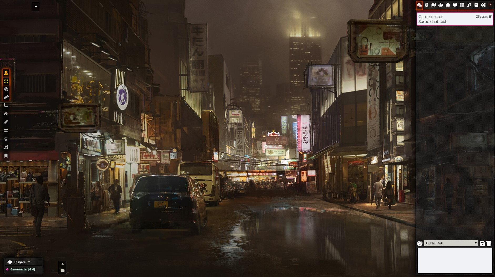

## Minimal UI for FoundryVTT

Reduces the size of Foundry interface and allows hiding or collapsing specific parts of it.

This includes hiding Foundry's Logo, Players List, Scene Navigation and Macro Bar.

Various settings allow for tweaking to personal tastes although the premise is simplicity.

* Hidden Foundry Logo
* Allows hiding Players List (Default: Visible)
* Allows Hiding or having the Macro Bar collapsed (Default: Collapsed)
* Allows Hiding or having the scene navigation collapsed (Default: Collapsed)
* Shrinked player list, icon and font sizes on the main interface
* Shrinked icon size and position of the left-side controls as well as vertical expansion

### ToDo:
* Add an extra option for Players List to have it visible but completely collapsed
* More fine-tuning of settings in regards of space and basic UI elements
* Customized macro hotbar size

Any feedback welcome
