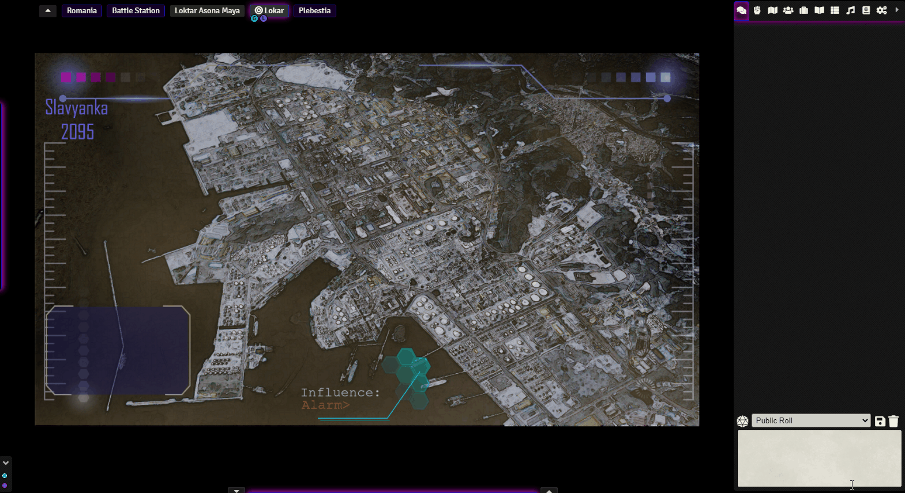
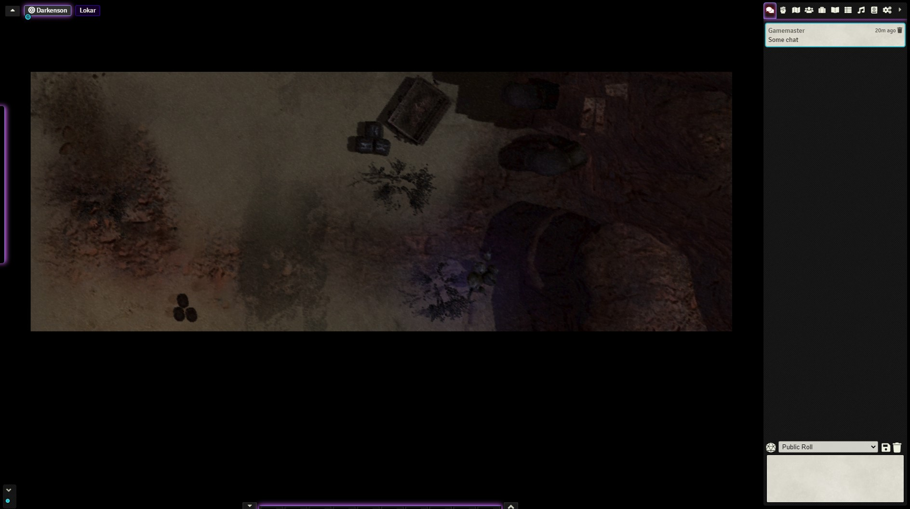

# Minimal UI for FoundryVTT

Extremely Configurable UI module, allows the user to hide, collapse or auto-hide components separately.

This includes hiding Foundry's Logo, Players List, Scene Navigation and Macro Bar.

If you like my work, please [invite me a Coffee](#by-jeansenvaars) :)

## Special Minimal UI Companions

### Window Controls
* Let your windows have Minimize, Maximize, Close and Pin Buttons to finally find that character among the many windows open you have
* Organize both minimized and open windows in a lean (invisible when not used) window bar
[Check it out](https://foundryvtt.com/packages/window-controls)

### Scene Preview
* Take a quick look at your inactive scenes by moving your mouse over the navigation panel
[Check it out](https://foundryvtt.com/packages/scene-preview)

## Foundry Logo
* Custom logo image can be provided
* Foundry Logo may be hidden or resized
* Can be made clickable to toggle show/hide HUD (Including chat or not)
  
## Player List
* Players list may be hidden completely, shown on mouse over or shown normally
* Small or standard sizes available

## Right Side Panel
* May be collapsed by default
* Use with Dynamic Mode for a pseudo auto-hide experience
* Improves FoundryVTT collapsed sidebar behavior when clicking again already opened apps, that are minimized or active
  
## Scene Navigation
* Allows Hiding or having the scene navigation collapsed by default
* Preview scenes when moving your mouse over the scenes
Note: Since Foundry 0.8.x Scene Navigation Preview is on a separate module, look for **Scene Preview**: https://github.com/saif-ellafi/foundryvtt-scene-preview

## Macro Hotbar
* Macro Bar may be hidden, collapsed, auto-hidden (default) or shown
* Macro Bar may be customized to 3 slots, 6 or default 10
* Macro Bar may be repositioned along the X-Axis

## Left Side Control Buttons
* Left controls may be collapsed into a single column (or not)
* May be shown normally or auto-hide mode on mouse over 
* Left controls may be standard or small size
* Left controls may be repositioned along the Y-Axis

## Camera/Audio Controls
* Allows hiding player camera boxes, showing only GMs
  
## Customization
* Default settings target a balance between gaining space and functionality
* Colors of borders and shadows and their strength customizable across all Foundry VTT
* Define Transparency when moving the mouse over components!
* Check the settings to customize your experience!

## Patches to Foundry
These are bugs in FoundryVTT that are not currently addressed, Minimal UI fixes them because they are more obvious here
* When clicking on a sidebar menu that was opened but then closed, clicking on it will open it again instead of doing nothing
* If a window is minimized, when reopened, it would be maximized instead of doing nothing
* If a window is open, but behind other windows, it would be brought ot the front when reopened, instead doing of nothing

## By JeansenVaars

## Check out my other modules!
* Window Controls (Recommended combination!)
* Scene Preview (Recommended combination!)
* Super Select

# Support with Systems and Modules
MinimalUI is made as agnostic as possible. Yet, it is impossible to ensure maximum compatibility.
I invite you to share any systems or modules that conflict with MinimalUI or do not look correctly.
Also do share systems and modules Minimal UI already works with too!

# Build from Source
Plugins: `rollup`, `rollup-plugin-css-porter`, `npm-build-zip`
Build Script: `npm run build`

# Appreciations
* Thanks to colorsettings by ardittristan: Minimal UI has a color picker!
* Thanks to vance in the FoundryVTT Discord: Minimal UI is better written!
* Thanks to the FoundryVTT Discord community for the amazing issue reports and feedback.
* Thanks to Merudo for being the first code contributor to Minimal UI as an open source module!
* Thanks to Greayhead for German Translations

# License
[MIT License](./LICENSE.md)

# Powered By

Thanks to JetBrains I can work on this project using **WebStorm**.
