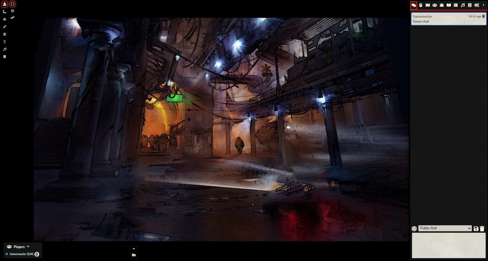

## Minimal UI for FoundryVTT

Minimalistic UI. Aggressivelly hides and shrinks non-essential UI hud elements from the screen.
This includes hiding Foundry's Logo, Scene Navigation and Macro Bar.
For Scene Navigation, I Highly recommend to combine with DF Scene Enhancement module by flamewave000.

This module may not be suitable for everyone, but those that don't need Macro Bar 
and are willing to navigate through the Scene Directory instead, may appreciate the 
space on screen to focus more on the game.

* Hidden Foundry Logo
* Hidden Scene Navigation panel (Notice you can no longer allow player navigation unless DF Scene Enhancement)
* Macro Bar collapsed by default and centered in screen
* Shrinked player list and fonts
* Shrinked icon size and position of the left-side tools, and moved up

Any feedback welcome
