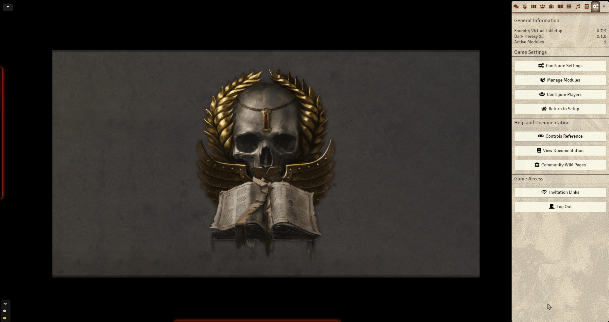

## Minimal UI for FoundryVTT

Configurable UI module, allows the user to hide, collapse or auto-hide components.

This includes hiding Foundry's Logo, Players List, Scene Navigation and Macro Bar.

Many settings allow for tweaking to personal tastes including size, position and behavior of UI elements.

* Hidden Foundry Logo
* Scenes, Player list and left side controls customized for minimalism by default 
* Macro Bar may be hidden, collapsed, auto-hidden (default) or shown
* Macro Bar may be repositioned horizontally
* Compact Players list shows the names only on mouse over
* Allows Hiding or having the scene navigation collapsed (Default: Collapsed)
* Left controls may collapse vertically in a single column or as a new column like normally
* Left controls may be resized, moved vertically and auto-hidden

### ToDo:
* Compatibility with other modules
* Deal with webcam feature
* Any suggestions welcome

