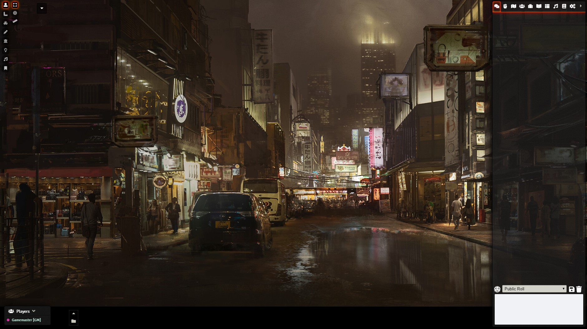

## Minimal UI for FoundryVTT

Reduces the size of Foundry interface and allows hiding or collapsing specific parts of it.

This includes hiding Foundry's Logo, Scene Navigation and Macro Bar.

Settings allow for customizing which components to hide or to collapse by default.

For those who hide Scene Navigation, I Highly recommend combining with DF Scene Enhancement module by @flamewave000.

This module may not be suitable for everyone, but some may appreciate the space on screen gained to focus on the game.

Changes are very minimal and do not have any impact on performance whatsoever.
Should not affect or impact other UI modules.

* Hidden Foundry Logo
* Allows hiding Players List (Default: Visible)
* Allows Hiding or having the Macro Bar collapsed (Default: Collapsed)
* Allows Hiding or having the scene navigation collapsed (Default: Collapsed)
* Shrinked player list, icon and font sizes on the main interface
* Shrinked icon size and position of the left-side tools, and moved up to save space

Any feedback welcome
